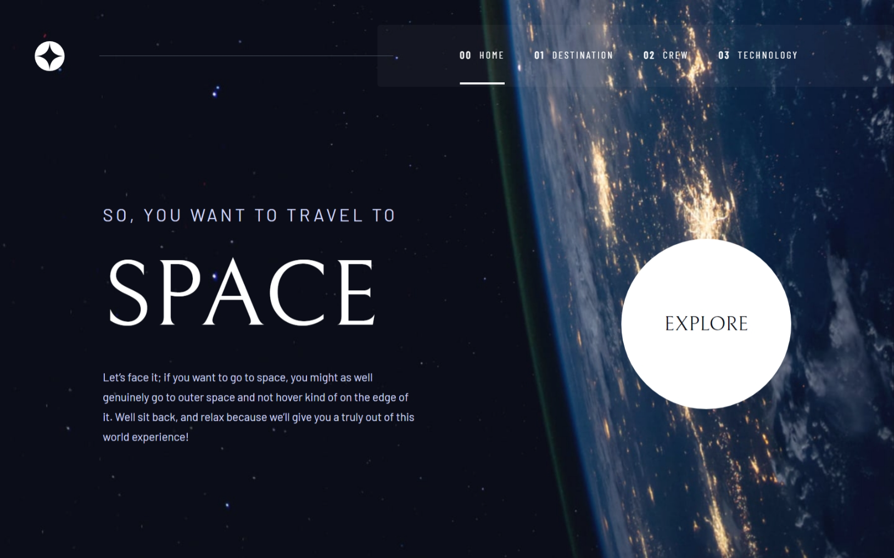
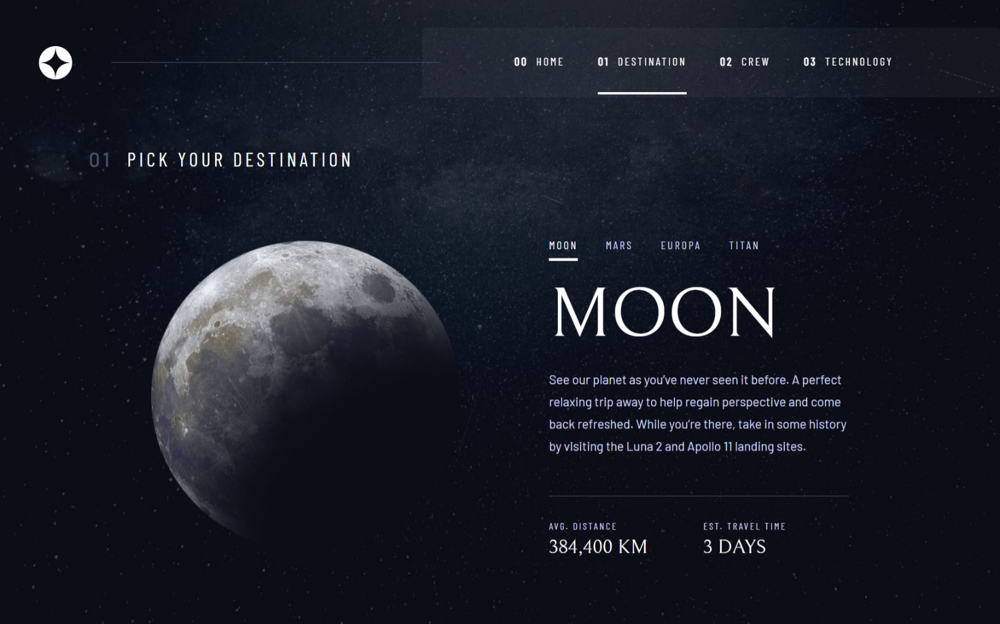
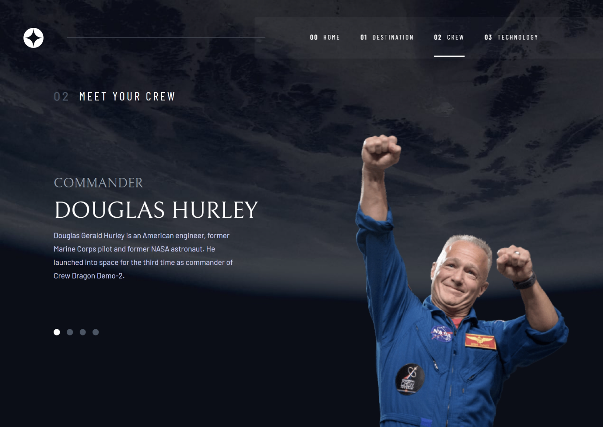
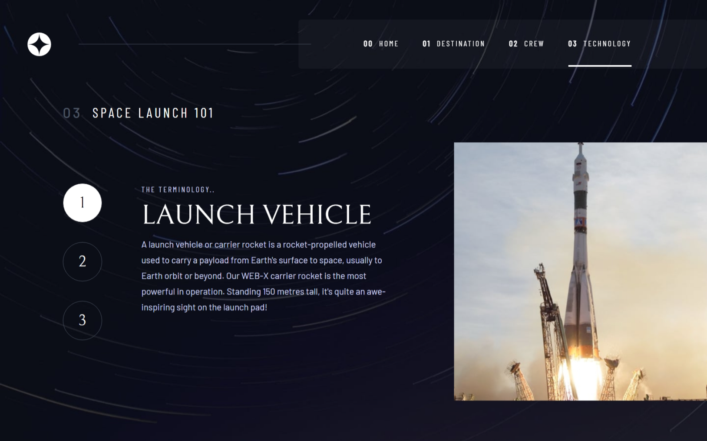

# Frontend Mentor - Space tourism website solution

This is a solution to the [Space tourism website challenge on Frontend Mentor](https://www.frontendmentor.io/challenges/space-tourism-multipage-website-gRWj1URZ3). Frontend Mentor challenges help you improve your coding skills by building realistic projects.

## Table of contents

- [Overview](#overview)
  - [The challenge](#the-challenge)
  - [Screenshots](#screenshots)
  - [Links](#links)
- [My process](#my-process)
  - [Built with](#built-with)
  - [What I learned](#what-i-learned)
  - [Continued development](#continued-development)
  - [Useful resources](#useful-resources)
- [Author](#author)

**Note: Delete this note and update the table of contents based on what sections you keep.**

## Overview

### The challenge

Users should be able to:

- View the optimal layout for each of the website's pages depending on their device's screen size
- See hover states for all interactive elements on the page
- View each page and be able to toggle between the tabs to see new information

### Screenshots






### Links

- Solution URL: [Add solution URL here](https://your-solution-url.com)
- Live Site URL: [Add live site URL here](https://your-live-site-url.com)

## My process

### Built with

- [React](https://reactjs.org/) - JS library
- [Tailwindcss](https://tailwindcss.com/) - CSS framework
- [Framer Motion](https://www.framer.com/motion/) - For animations
- Semantic HTML5 markup
- CSS custom properties
- Flexbox
- Mobile-first workflow
- Responsive UI design

### What I learned

Use this section to recap over some of your major learnings while working through this project. Writing these out and providing code samples of areas you want to highlight is a great way to reinforce your own knowledge.

To see how you can add code snippets, see below:

```html
<h1>Some HTML code I'm proud of</h1>
```

```css
.proud-of-this-css {
  color: papayawhip;
}
```

```js
const proudOfThisFunc = () => {
  console.log('🎉')
}
```

If you want more help with writing markdown, we'd recommend checking out [The Markdown Guide](https://www.markdownguide.org/) to learn more.

**Note: Delete this note and the content within this section and replace with your own learnings.**

### Continued development

Framer-Motion has an extensive set of beautiful animations and can be used to make websites more interactive. Till now I have only used it for simple animations like fade-in, fade-out, etc. I would love to learn more about it and use it to make more complex animations.

Tailwindcss is a great CSS utility framework and allows for faster development owing to shorthand styling. Although I have extensively used it, I am still unfamiliar with its theming and dark mode features. It would be an interesting challenge to explore this and would make for a useful skill.

### Useful resources

- [Framer-Motion Documentation](https://www.framer.com/motion/) - The documentaion is fairly well written and has some interesting examples as well. However, I sometimes found it to be a bit lacking. Nonetheless, it is an extremely good resource for anyone looking to learn Framer-Motion.
- [TailwindCSS Documentation](https://tailwindcss.com/) - A lifesaver for checking out the various utility classes and their usage. The documentation is very well written and has a lot of examples as well.

## Author

- Website - [Khizar Nawab](https://www.your-site.com)
- Frontend Mentor - [@HickeryDickery](https://www.frontendmentor.io/profile/HickeryDickery)
- Github - [@HickeryDickery](https://github.com/HickeryDickery)
